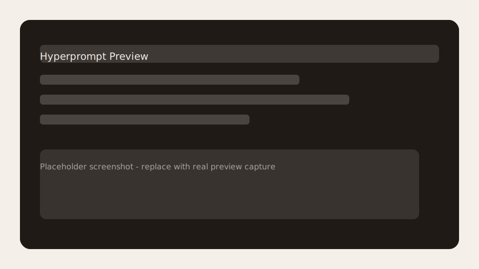

# Hyperprompt VS Code Extension

Hyperprompt language support for VS Code, backed by the Hyperprompt EditorEngine RPC.

## Features

- Hypercode syntax highlighting for `.hc` files.
- Compile commands (strict and lenient) with output in the Hyperprompt output channel.
- Live preview panel with compile-on-save updates.
- Navigation helpers: go-to-definition and hover for file references.
- Diagnostics surfaced in the Problems panel on save.



## Commands

- `Hyperprompt: Compile` — compile in strict mode.
- `Hyperprompt: Compile (Lenient)` — compile in lenient mode.
- `Hyperprompt: Show Preview` — open or refresh the preview panel.

## Settings

- `hyperprompt.resolutionMode` (`strict` | `lenient`, default: `strict`)
- `hyperprompt.previewAutoUpdate` (default: `true`)
- `hyperprompt.diagnosticsEnabled` (default: `true`)
- `hyperprompt.enginePath` (absolute path override, default: empty)
- `hyperprompt.engineLogLevel` (`error` | `warn` | `info` | `debug`, default: `info`)

## Requirements

- macOS or Linux (Windows is not supported yet).
- Hyperprompt CLI built with the Editor trait (`swift build --traits Editor`).
- `hyperprompt` available on PATH or configured via `hyperprompt.enginePath`.

## Usage

1. Open a `.hc` file to activate the extension.
2. Use Command Palette to run compile or preview commands.
3. Hover or go-to-definition on `@"..."` references.
4. Save files to refresh diagnostics and preview output.

Preview output renders raw Markdown text in a styled panel (Markdown-to-HTML rendering is a future enhancement).

## Development Testing

From `Tools/VSCodeExtension`:

```bash
npm install
npm run compile
code --extensionDevelopmentPath="$PWD"
```

In the Extension Development Host:
- Open a `.hc` file to trigger activation.
- Run commands from the Command Palette.
- Watch the "Hyperprompt" output channel for compile output.

If `code` is not found, install it from VS Code: Command Palette → "Shell Command: Install 'code' command in PATH".

## Engine Setup

Build the CLI with the Editor trait and ensure it is discoverable:

```bash
swift build --traits Editor
export PATH="/path/to/Hyperprompt/.build/debug:$PATH"
```

The extension resolves the engine in this order:

1. `hyperprompt.enginePath` setting
2. Bundled binary (`bin/hyperprompt` inside the extension, if present)
3. `hyperprompt` on PATH

## Release Packaging (VSIX)

```bash
npm install -g @vscode/vsce
npm install
vsce package
code --install-extension hyperprompt-*.vsix
```

## Known Issues

- Preview panel renders raw Markdown (not HTML-rendered).
- Extension integration tests require VS Code download and may time out on slow networks.

## Release Notes

### 0.0.1

- Initial preview release: compile commands, navigation, diagnostics, and preview panel.
